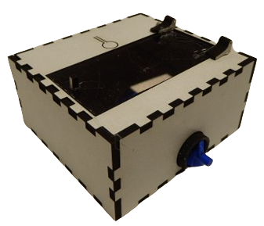

# FishFeeder

Standalone automatic fish feeder, based on a ESP8266 with esphome.

Just dispenses (fish) food using a 3D-printed (archimedean) two flute scew. It uses a modified servo motor to drive the screw, such that it no longer has angle limits. A secondary servo is installed to open a lid of the fish tank, as well as a vibration motor to make the dispenses more consistent. An additional relay can be installed to control some form of lighting.

It is intend to be used stand-alone, but because it is written using the esphome project, it can easily be integrated in the rest of your home-automation.

## Getting started

Take a look at the [docs](https://ColoMAX.github.io/fish_feeder).

## TODO

- test code: daylight saving switch
- custom css
- Add light control (timer)
- Make scheduler O(1) instead of O(n) (good compiler will do so automatically, but not verified on xtensa compiler)
- Add factory default button
- Add reset button for the last feed time.
- Add Troubleshooting chapter.
