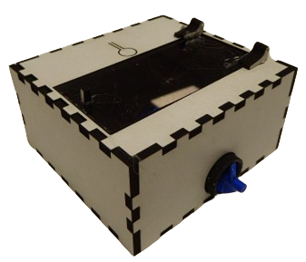

# Getting started

If you do not already have the fishfeeder, than first go to [Overview](overview.md#overview) before continuing this document.

## Initial Setup

- Power on the device by connecting the power port (likely a micro-usb or usb-C port on the device). The device should not pull more than 500mA at 5v, thus any usb power source should suffice, but do mind to use a short or high quality usb cable.
  > Tip: you can test whether the device is properly working, by pressing the button on the top for around 1 second. The dispenser screw should start to turn and stop as you release it. If not, there is likely something wrong with your power connection.
- The first time your power on the device, it will create a WiFi access point, named "Fish Feeder Hotspot". Connect to it using the password `SomethingFishy`.
- Now your device should ask you, or redirect you towards the configuration page of the device. If not, you can manually go to the website `http://192.168.4.1`, making sure you are still connected to the access point of the fishfeeder.
  > Alternatively you can try to connect the device via usb to your computer and visit [Improv via Serial](https://www.improv-wifi.com/) to set the initial WiFi credentials directly, without using the hotspot. **NOTE** not all browsers support this feature, the site will indicate if so.
- (optional) Here you can apply any updates (`*.bin` e.g. `firmware.bin` file) if provided to you.
- Now you can configure you WiFI settings inside of the fishfeeder.
- After successfully submitting you WiFi credentials to the device, you should see the access point disappear. After which you should be able to connect to the general configuration panel of the device by navigating to `http://fishfeeder.local`.
- In this configuration panel you can modify the feeding schedule and amount.
  > Tip: you can test the amount dispensed per feeding time, by doing a manual feed via this configuration panel. Do make sure you added enough fish food in the top compartment of the device.
- After your are done configuring, you can safely exit the configuration, but do not unplug the device right away. The settings will be store automatically after a few moments (within 1 minute).

## Configuration

- Open the configuration page when connected to the same WiFi network as your fishfeeder.
- Navigate to `http://fishfeeder.local`.
- Now you should be greeted with the configuration page.

The feeder will dispense a configurable amount of food based on a schedule you can provide. This schedule can be configured to be active only on certain days (`Once every ...  days`), such as; each day (1), every second day (2), one a week (7).
Then on those days, you get set a starting and ending time, in which the feeder can dispense. Within this time frame, you can set the number of times it will need to feed.

You can configure the amount dispensed per feeding, which is an *arbitrary scale*, so test it out. This can be done by modifying the scale, and than pressing the manual feed button on the webpage to dispense this amount.

## Maintenance

From the configuration page you can also apply updates manually if you have access to an update file, by uploading the `.bin` file.

## Troubleshooting

- Make sure yo have a **proper power supply** and a working power cable connected to the feeder.
- If you are unable to do a firmware update, you can try to restart in safe-mode, vai the configuration webpage, before uploading the file.
- If you have troubles with applying your new schedule, you may want to reset the scheduler, which you also can do via the webinterface. After which you should be able to see that the last feed time changed.
- If you are helpless you can also try to reset to **factory defaults**:
    - If you can access the configuration webpage, you can reset back to factory defaults over there.
    - If not, you can use the button on the device itself: You need to do three rapid salvos of one short press, then one longer (0.5 seconds), similar to a heartbeat. 10 seconds after the lasst lomg press, will it vibrate (assuming vibration motor is installed), and do the factory reset.

Lastly you can try to submit a new issue on github if you are not able to figure it out yourself.
